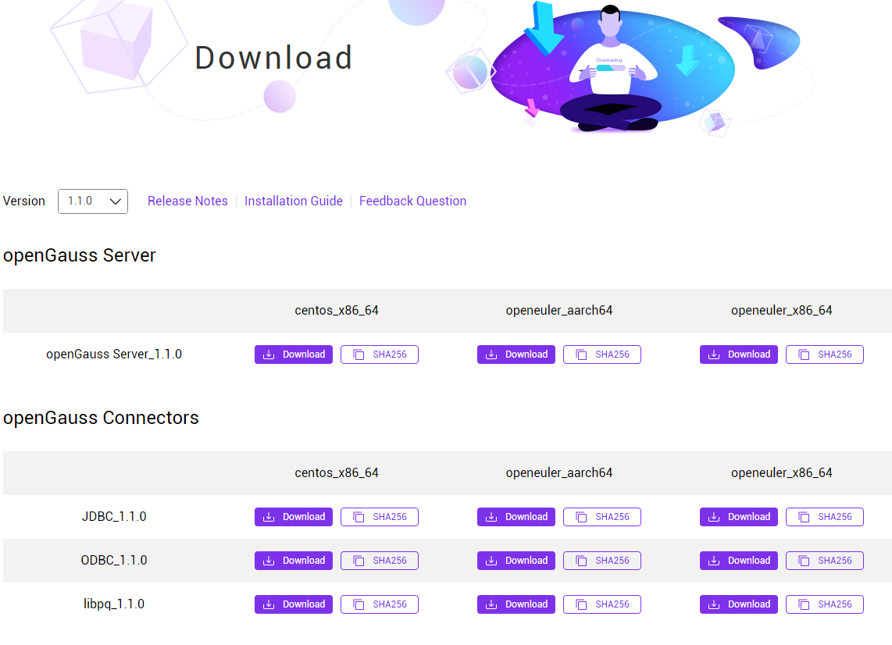

First of all, happy New Year's day from openGauss! On the first day of 2021, openGauss officially releases Version 1.1.0. openGauss 1.1.0 is positioned as an updated version and is compatible with the features and functions of the 1.0.1 version. It supports the following functions:

LIST partition, HASH partition, DDL permission granting and reclaiming, cascaded standby node, PostgreSQL-compatible character data type, automatic index recommendation, PL/Python, standby server backup, autonomous transaction rebuilding, parallel query rebuilding, sysdate data type, and adding or deleting standby server nodes, multiple Python versions, online index adding, upgrade tool, and installation and OM tool decoupling.

#### New Features

openGauss 1.1.0 is an updated version of openGauss 1.0.0. Features and functions of this version are compatible with those of the previous version. The new features are as follows:

- Supports LIST partition and HASH partition.

The list partitioning function divides the key values in the records to be inserted into a table into multiple lists (the lists do not overlap in different partitions) based on a column of the table, and then creates a partition for each list to store the corresponding data.
The hash partitioning function uses the internal hash algorithm to divide records to be inserted into a table into partitions based on a column of the table. If you specify the PARTITION parameter when running the CREATE TABLE statement, data in the table will be partitioned.

- Supports LIST partition and HASH partition.

  - The list partitioning function divides the key values in the records to be inserted into a table into multiple lists \(the lists do not overlap in different partitions\) based on a column of the table, and then creates a partition for each list to store the corresponding data.
  - The hash partitioning function uses the internal hash algorithm to divide records to be inserted into a table into partitions based on a column of the table. If you specify the **PARTITION** parameter when running the **CREATE TABLE** statement, data in the table will be partitioned.

- Supports equality query in a fully-encrypted database.

  A fully-encrypted database is a database system dedicated to processing ciphertext data. Data is encrypted and stored in the database server. The database supports retrieval and calculation of ciphertext data and inherits the original database capabilities related to query tasks, including the lexical parsing, syntax parsing, execution plan generation, transaction consistency assurance, and storage. The performance deterioration does not exceed 10% compared with that of non-encrypted computing.

- Enhances primary/standby HA.

  - Supports the cascaded standby node which replicates logs from the standby node to reduce the service processing pressure of the primary node.
  - Scales the number of standby nodes to 8 nodes.
  - Supports the **catchup2normal_wait_time **parameter configuration. After the standby node starts and establishes a connection with the primary node, it is in log catchup mode. If the difference between logs that are caught up is less than the value of **catchup2normal_wait_time**, the standby node is changed to synchronous mode.
  - Supports non-synchronization of configuration files. The configuration parameters of primary and standby nodes vary according to the specifications of hardware where nodes are deployed. Therefore, the original synchronization function is modified and you do not have to synchronize parameter configuration files between the primary and standby nodes.

- Expands the data type compatibility.

  Both char and varchar are compatible with PostgreSQL mode. When the length is calculated, the length of the character instead of the length of the byte is returned.

- Adds monitoring dimensions.

  Monitors the **sort&hash** information about **work_mem **in the view returned by **get_instr_unique_sql\(\)**.

  Adds the **WAIT_EVENT_WAL_BUFFER_ACCESS **and **WAIT_EVENT_WAL_BUFFER_FULL **wait events to the **get_instr_wait_event **view to monitor **wal_buffer**. **WAIT_EVENT_WAL_BUFFER_ACCESS **counts the number of times that the WAL buffer is accessed. \(In consideration of performance, the access duration is not measured.\) **WAIT_EVENT_WAL_BUFFER_FULL **collects statistics on the number of access times and access duration when the WAL buffer is full.

- Enhances AI.

  Automatically recommends proper indexes for simple queries based on the access conditions of SQL statements.

- Supports PL/Python.

  Supports the Python language as the SQL programming language.

- **gs_basebackup **supports standby node backup.

  **gs_basebackup **can back up data from the standby node to reduce the service processing pressure of the primary node.

- Refines permission management models.

  Supports DDL permission granting and revoking.

- Rebuilds autonomous transactions.

  Rebuilds the inter-process communication method used by the original autonomous transaction implementation to the inter-thread communication method, which is simpler.

- Rebuilds parallel queries.

  Rebuilds a unified parallel framework to replace the original parallel query framework and the distributed cross-node parallel query framework.

- Supports the sysdate data type.

  Sysdate returns the current date and time, which are the time zone and time of the Linux OS on a host machine where the database is located.

- Supports standby node adding or deleting.

  Provides the OM tool to support online scale-out and scale-in of standby nodes which can be dynamically added or deleted without affecting services.

- Supports multiple Python versions.

  On CentOS, the database installation depends on Python 3.6. The released 1.1.0 version can be installed in Python 3.7. You can also build third-party libraries based on the specified Python 3.\_\* \_version to adapt to more Python versions.

- Supports adding an index online.

  Uses the **create index concurrently** syntax to create indexes online without blocking DML.

- Provides the upgrade tool.

  Supports the upgrade from 1.0.1 to 1.1.0.

- Decouples installation from the OM tool.

  The OM tool is decoupled from the database kernel in the 1.1.0 version:

  1.  The OM tool is stored in the openGauss-OM repository which will be used to manage the OM tool code.

  2.  The OM tool and kernel are packaged separately. You can place the images of the OM tool and kernel in the same directory and use the OM tool to install them. The installation method remains unchanged. If only the kernel is concerned, you can decompress the kernel image and run it separately.

#### After seeing so many new features, do you really want to try? Come and download it.

Download Link：<https://opengauss.org/en/download.html>

In addition, the community user experience team has upgraded the openGauss official website, just to let you have a better experience.

#### openGauss planet is very powerful | fun dynamic lets you understand openGauss features in seconds

In order to highlight such powerful features, the community user experience team not only streamlines the large text, but also carefully creates a group of visual concise, vivid and easy to understand interesting hover effects, so that you can not only add infinite fun in the process of browsing the website, but also easily remember the four core features of openGauss.

#### openGauss planet is very fashion | brand illustrations let you soar in the data universe

In order to let you immerse yourself in the data world brought by opengauss from the first moment you enter the opengauss community website, the experience team has customized a series of fashionable and bright art illustrations in combination with scene creativity, and created a bright data universe through data geometry, star developers and other elements, so that you can fly freely in the fantasy data space And jointly expand our data space in exploration and pursuit.

#### openGauss planet is very friendly | easy to use features allow you to enjoy the website

The experience team is always around the core design concept of "user experience centered" in all aspects of website revision and optimization, and is committed to making opengauss community website not only "good-looking", but also "easy to use". This design concept is reflected in various details of the website. For example, the download page once simply listed a large section of complex sha256 consistency check code, which not only affected the simplicity and beauty of the website page, but also added the inconvenience for users to manually select and copy. In the new version of opengauss Download page, the long string of sha256 consistency check code was extremely simplified into a button, and the users only need to use it You can copy the sha256 code to the pasteboard with one click, which not only improves the user experience, but also ensures the beauty of the page.

Finally, I would like to thank you for your attention and support to opengauss in the past year, especially the following friends who have participated in the community contribution.

#### Contributors (Gitee Account)

wanfang5, sqyyeah, lvmiao1229, zhang*xubo, zzzzzdb, scarbor_fair, liumin35, jia_junfeng1, chendong76, hongyehongye1, xiangxinyong, lee1002, wuyuechuan, cyw-0-ng, wanggzzs, huiu924, zhouxiongjia, zha_hw, anikikong, gongsiyi150, vastbase_yzhang, willemjiang, zhangxiaohai928, zhangzhijingMY, pan-jun, sun_xu_zong, wang-tq, y1309639, yansong_lee, emmajiang, li-jun056, liang*-123, liyang0608, llzx373, otis4631, totaj, xixicat, zhanglf-zkfr, chenxiaobin19, diagon-alley, gaojia629, gentle_hu, houjhibofa, jin_li, justbk, lys6676, xiezhipeng1, yidianjiujin, you-and-me, yunlongg, alienmoe, chenguojie, deadsec, dolphin-m, enbokang, gauss**gaoshi, giteegauss, grozazz, hillseas, hthinks, johnnyzhou, li_jianqiu, like11, nifinity, nwen_hw, pikeTWG, realzhouqingqing, reganhe_xx, struggle_hw, vinothv, weim-123, wustczx, xiong_xjun, yangyang374, ylfan96, yutang1, ywzq1161327784, zbxue, Adoube_548, RayH2020, barbedcc, bertliu, big_pig_123, bosihouzi, bowen9799, bzhaoop, catofpei, chen_chenn, chennaidong, chenzang, chunlei007, cylfsbm, dikk123, flytigerman, fss567, gwchengcheng, hemny, husan1024, initlove, jane_minjun, jcc123, jeffee, jerome-duomi, jie_lei, jimmyhujiming, jinyu_opengauss, jitao10, kamusis, karna, kivaking, lazpf, liangweii, lilexun, linxiaoxu131415, liushengxi, lizhenfeng123, ljiot, lmte3e4, luyao201, ma_xiaodi, matrix0xcc, nanmu2018, nonolili527, open**gs**2020, panchenbo, qq45068, romber, s36326, seulingfeng, stanleyren, sun_madman, templingfeng, tiantianxiangshang2020, tomas**junny, tonyhehe, toyato, trollzhao, wang_deng_yang, wangrui_rui, wei-haixu, weihan666, wenbling, wjmcat, wjzeng, wn952000, wotchin, xinmiaomiao, xue_meng_en, xzyinyong, yangkang52, yuzhenglin, yz_db, zhaorenhai, zhouzhishan, zilf, zju_hzd, zp123456, zumingjiang, zzcyd, I-am-a-robot, april01xxx, buter, chenlinfeng3, chinapenglin, code_wolf, cyqw, database_structure, ddwolf, dengxuyue, duoketang, duomibabi, ericwangpeng, gaiguoqiang12, gaoyunlong12, georgecao, gwp2464, gyt0221, hangjin2020, hljhnu, huangchengcheng1, huangzijian888, iloveuever, jiang_jianyu, jiangxiangbo, jixi_hexi, lesliexx, liheng188, lihongda12, linianA, lisa100, lishifu_db, liu_hui199828, liujunchigo, liuxu34, liyifeng-seu, looplocked, lqkitten, luo_zihao5524, luohongbins, lvhui123456, meimeidtt, minshengyunwei, mujinqiiang, opengauss_yanghaiyan, opgauss, pku\_\_lisihao, plusvolcano, popastin, qin-wei, shaga, shenyuflying, shirley_zhengx, siven_dev, sl0915, sword-fairy-water-easy, tedlz123, thexiong7, tuohai666, victor-zhc, wang_pei_heng, wangdengke6, wangxinlian, wangzhijun2018, xiliu_h, xukunpeng, xzx666, yang558, yinzhishu, yuejiashen, yujiangaaa, yukai_k, zankyfun4, zerodefect, zhangshujie82, zhangyulong34, zheng_zelin, zhengyuhanghans, zhongjun2, zhu_jinwei

Welcome to the openGauss community code repository and submit an issue for your suggestions on the new version.

openGauss repository: <https://gitee.com/opengauss>

openGauss mirror repository: <https://github.com/opengauss-mirror>
